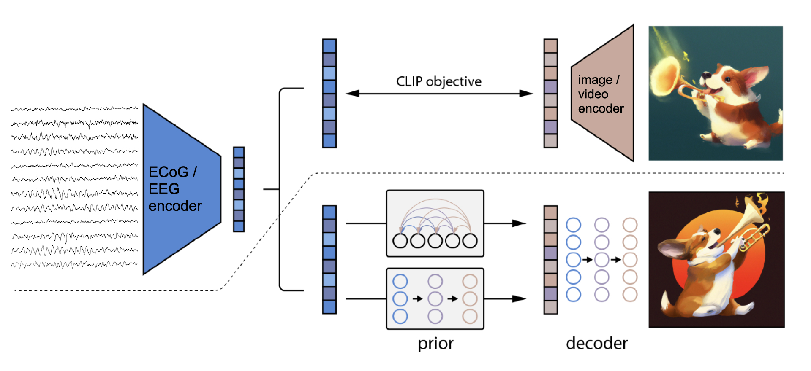

# neuro-diffusion

## Overview

<div align="center"></div>

References

- Hierarchical Text-Conditional Image Generation with CLIP Latents ([Ramesh et al., Apr 2022](https://arxiv.org/pdf/2204.06125.pdf))

### DALLE-2 Video

References

- Video Diffusion Models ([Ho et al., Apr 2022](https://arxiv.org/abs/2204.03458))

- Imagen Video: High Definition Video Generation with Diffusion Models ([Ho et al., Oct 2022](https://arxiv.org/abs/2210.02303))

## Status

### YLab GOD

- (8/14) 画像掲示からseq_len=0.5秒間のECoGを使っていたので情報が乗っていないのかもしれない．画像掲示から0.5-1.0, 1.0-1.5, 1.5-2.0秒間のECoGで訓練sweep

- (8/10) mixed_deepでもまったくtest accが上がらなかったので，mixed_shallowを作成，CLIP sweepを開始．ついでにconv blockのkernel sizeを3, 5, 7でsweep

- (8/7) 訓練とテストを混ぜてからdeep splitするmixed_deep splitを作成，CLIP sweepを開始．そのパフォーマンスによってはpriorの訓練に移る．

### UHD

- (8/18) Unet3DEncoderを使ったCLIP学習はViViTほどパフォーマンスが出ない．ViViTReduceTimeを実装，CLIP学習を開始．学習途中のUnet3DEncoderではあるが，static embeddingでパイプラインを通してデバッグするための`eval_clip.py`を開始．

- (8/17) CLIP学習用のUnet3dEncoderを実装．

- (8/16) Unet3Dを実装．

- (8/15) Video Decoderを30Hzのまま訓練することはGPUメモリの不足でできないので，16サンプル(5.3Hzくらい)でやりなおし．パイプラインを走らせるときもDatasetやCollateFnでリサンプリングする．

- (8/10) CLIP学習がおわっていないがevalを回してclip_embdsをいったん作ってprior訓練してみる．

- (8/9) dalle2_videoのサンプリングに関するメソッドが動画に対応したので，パイプライン走らせられる状態になった．依然時間次元30HzのCLIP学習待ち．
  - 学習済みCLIPモデル：`runs/uhd/video/d_drop-0.3_/`


- (8/8) Diffusion priorの訓練でロスがnanになったが，元々はならず大きな変更も加えていない．パイプライン全体の訓練を最初からやってみる．今は30Hzのまま時間次元ありCLIPを学習中．

- (8/8) Downsamplingスクリプトがおわったが，CLIP embeddingが時間次元を持ったままのパイプラインを作ることにした．時間次元をバッチ次元とflattenしてのprior trainingを走らせている．Video decoderの訓練はすでに前やってある（分散を学習しないことで学習を安定させたやつ）．

- (8/7) Videoを一つのCLIP embeddingにしてやるパイプラインのためのdownsamplingスクリプトのおわり待ち．おわったら実行：`python brain2face/train_clip.py config_path=uhd/video/clip.yaml`

## TODOs

Aug

- [x] dalle2_videoのサンプリングメソッドたちを動画に対応させる．

Jul

- [x] 他のconfigファイルの内容をimage.yamlに合わせる
- [x] Preprocessingのfaceの出力を.npyから.h5にする
- [x] args.face.encoded=Trueでも元の画像を保存できるようにする
  - [x] この過程でargs.face.pretrainedに変わったので，YLabGOD以外も対応させる
  - [x] train_clip.pyも今動かない状態
- [ ] Uknown subjectのとき全subject layersの出力の平均を取るようにしているが，これで良いのか考える
  - Known subjectでのactivationとの類似度とかを取ってそれで重みづけするとか
- [ ] 毎回のsweepで一つchance modelが走るようにする
- [x] YLabGOD以外も`y_reformer`を`loader`にする
- YLab
  - [x] チャネル空間座標の導入
  - [x] 実時間を3秒からハイパラにする
    - [x] Segmentingしないpreprocessingの追加
    - [x] Datasetsに内部でsegmentingするモードを追加
  - [ ] priorを訓練して本物のimage imbとの相関を取る
  - [x] AU_rだけを使う
- UHD
  - [ ] 負のシフトを受け付ける（録画がEEG記録の前に始まってしまった？セッション）
- Decoder training
  - [x] `NeuroDiffusionCLIPEmbVideoDataset`のメモリー問題を解決

<br>

## Yanagisawa Lab GOD dataset

### Preprocessing

```bash
python brain2face/preprocs/ylab_god.py
```

### CLIP training

```bash
# Normal
python brain2face/train_clip.py config_path=ylab/god/clip.yaml 
# Sweep
nohup python brain2face/train_clip.py config_path=ylab/god/clip.yaml sweep=True > logs/ylab/god/sweep_clip.log &
```

#### Run CLIP evaluation and generate CLIP embeddings (+ corresponding images)

```bash
python brain2face/eval_clip.py config_path=ylab/god/clip.yaml
# For distributed DALLE-2 training, set for_webdataset=True in the yaml
```

#### Run DALLE-2 prior training

```bash
# Normal
nohup python brain2face/train_diffusion_prior.py > logs/ylab/god/diffusion_prior.log &
```

<br>

#### Run CLIP evaluation and generate CLIP embeddings (+ corresponding images)

```bash
python brain2face/eval_clip.py config_path=ylab/god.yaml
# For distributed DALLE-2 training, set for_webdataset=True in the yaml
```

#### Run DALLE-2 prior training

```bash
# Normal
nohup python brain2face/train_diffusion_prior.py > logs/ylab/god/diffusion_prior.log &
```

<br>

## Yanagisawa Lab OpenFace (E0030 dataset)

### Preprocessing

```bash
python brain2face/preprocs/ylab_e0030.py
```

### CLIP training

```bash
# Specify sweep configuration from .yaml
nohup python brain2face/train_clip.py config_path=ylab/e0030.yaml sweep=True > logs/ylab/sweep_clip.log &
```

<br>

## UHD

### Preprocessing

```bash
nohup python brain2face/preprocs/uhd.py start_subj=0 end_subj=8 > logs/uhd/out1.log &
nohup python brain2face/preprocs/uhd.py start_subj=8 end_subj=16 > logs/uhd/out2.log &
nohup python brain2face/preprocs/uhd.py start_subj=16 end_subj=22 > logs/uhd/out3.log &
```

### CLIP training

```bash
# Normal
python brain2face/train_clip.py config_path={path}.yaml

# Sweep
nohup python brain2face/train_clip.py config_path={path}.yaml sweep=True > logs/{path}.log &
```

### CLIP evaluation (save CLIP embeds + corresponding images / videos)

```bash
python brain2face/eval_clip.py config_path={path}.yaml
# For distributed DALLE-2 training (not working now), set for_webdataset=True in the config file.
```

### Run DALLE-2 prior training

```bash
python brain2face/train_prior.py
```

### DALLE-2 decoder training

#### Image

```bash
nohup python brain2face/train_image_decoder.py config_path=uhd/image/decoder.yaml > logs/uhd/train_image_decoder.log &
```

#### Video

```bash
nohup python brain2face/train_video_decoder.py config_path=uhd/video/decoder.yaml > logs/uhd/train_video_decoder.log &
```

### Finally, run the pipeline and generate images / videos from EEG

```bash
python brain2face/eval_image_pipeline.py config_path={path}.yaml
```

#### Distributed DALLE-2 prior training for image (deprecated)

```bash
python brain2face/distributed_train_prior.py
```

#### Distributed DALLE-2 decoder training for image (deprecated)

```bash
# tar face_images
bash tar_face_images.sh
# login to huggingface hub
huggingface-cli login
# create a repository in huggingface whose name matches tracker.save.huggingface_repo in decoder.json
# need to create this directory manually
mkdir .tracker_data
# Run distributedtraining
python brain2face/train_decoder_distributed.py
```


<br>

## Hayashi Lab @ AIST

- Submodule [encoder4editing](https://github.com/SeanNobel/encoder4editing)

- Download StyleGAN inversion model trained on FFHQ StyleGAN

```bash
cd encoder4editing/weights
gdown https://drive.google.com/uc?id=1EM87UquaoQmk17Q8d5kYIAHqu0dkYqdT
```

### Run preprocess (using 4 GPUs)

```bash
CUDA_VISIBLE_DEVICES=0 nohup python brain2face/preprocs/stylegan.py start_subj=0 end_subj=8 > logs/ica/out1.log &
CUDA_VISIBLE_DEVICES=1 nohup python brain2face/preprocs/stylegan.py start_subj=8 end_subj=16 > logs/ica/out2.log &
CUDA_VISIBLE_DEVICES=2 nohup python brain2face/preprocs/stylegan.py start_subj=16 end_subj=24 > logs/ica/out3.log &
CUDA_VISIBLE_DEVICES=3 nohup python brain2face/preprocs/stylegan.py start_subj=24 end_subj=32 > logs/ica/out4.log &
```