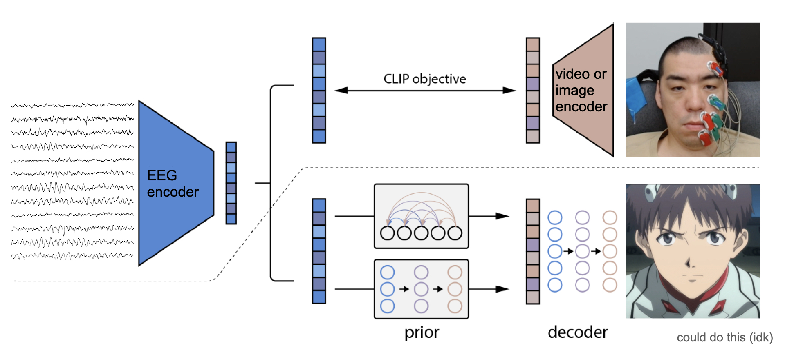

# brain2face

- [DALLE-2 paper](https://arxiv.org/pdf/2204.06125.pdf)

### TODOs

- [ ] 他のconfigファイルの内容をimage.yamlに合わせる
- [x] Preprocessingのfaceの出力を.npyから.h5にする
- [ ] args.face.encoded=Trueでも元の画像を保存できるようにする
- [ ] Uknown subjectのとき全subject layersの出力の平均を取るようにしているが，これで良いのか考える
  - Known subjectでのactivationとの類似度とかを取ってそれで重みづけするとか
- [ ] 毎回のsweepで一つchance modelが走るようにする
- YLab
  - [ ] 実時間を3秒からハイパラにする
    - [x] Segmentingしないpreprocessingの追加
    - [ ] Datasetsに内部でsegmentingするモードを追加
  - [ ] priorを訓練して本物のimage imbとの相関を取る
  - [ ] AU_rだけを使う
- UHD
  - [ ] 負のシフトを受け付ける（録画がEEG記録の前に始まってしまった？セッション）

## UHD

### Overview

<div align="center"></div>

### Usage

#### Run preprocess

```bash
nohup python brain2face/preprocs/uhd.py start_subj=0 end_subj=8 > logs/uhd/out1.log &
nohup python brain2face/preprocs/uhd.py start_subj=8 end_subj=16 > logs/uhd/out2.log &
nohup python brain2face/preprocs/uhd.py start_subj=16 end_subj=22 > logs/uhd/out3.log &
```

#### Run CLIP training

```bash
# Specify sweep configuration from .yaml
nohup python brain2face/train_clip.py config_path=uhd/image.yaml sweep=True > logs/uhd/sweep_clip.log &
```

#### Run CLIP evaluation and generate CLIP embeddings (+ corresponding images)

```bash
python brain2face/eval_clip.py config_path=uhd/image.yaml
# For distributed DALLE-2 training, set for_webdataset=True in the yaml
```

#### Run DALLE-2 prior training

- Normal training

```bash
python brain2face/train_diffusion_prior.py
```

- Distributed training

```bash
python brain2face/train_diffusion_prior_distributed.py
```

#### Run DALLE-2 decoder training

- Normal training

```bash
nohup python brain2face/train_decoder.py > logs/uhd/train_decoder.log &
```

- Distributed training

```bash
# tar face_images
bash tar_face_images.sh

# login to huggingface hub
huggingface-cli login

# create a repository in huggingface whose name matches tracker.save.huggingface_repo in decoder.json

# need to create this directory manually
mkdir .tracker_data

python brain2face/train_decoder_distributed.py
```

#### Finally generate face images from EEG

```bash
python brain2face/eval_pipeline.py config_path=uhd/image.yaml
```

<br>

## Hayashi Lab @ AIST

### Usage

- Submodule [encoder4editing](https://github.com/SeanNobel/encoder4editing)

- Download StyleGAN inversion model trained on FFHQ StyleGAN

```bash
cd encoder4editing/weights
gdown https://drive.google.com/uc?id=1EM87UquaoQmk17Q8d5kYIAHqu0dkYqdT
```

#### Run preprocess (using 4 GPUs)

```bash
CUDA_VISIBLE_DEVICES=0 nohup python brain2face/preprocs/stylegan.py start_subj=0 end_subj=8 > logs/ica/out1.log &
CUDA_VISIBLE_DEVICES=1 nohup python brain2face/preprocs/stylegan.py start_subj=8 end_subj=16 > logs/ica/out2.log &
CUDA_VISIBLE_DEVICES=2 nohup python brain2face/preprocs/stylegan.py start_subj=16 end_subj=24 > logs/ica/out3.log &
CUDA_VISIBLE_DEVICES=3 nohup python brain2face/preprocs/stylegan.py start_subj=24 end_subj=32 > logs/ica/out4.log &
```

<br>

## Yanagisawa Lab @ Osaka Univ.

### TODOs

- [ ] Import channel 2D map

### Usage

#### Run preprocess

```bash
python brain2face/preprocs/ylab_ecog.py
```

#### Run CLIP training

```bash
# Specify sweep configuration from .yaml
nohup python brain2face/train_clip.py config_path=ylab_ecog.yaml sweep=True > logs/ylab/sweep_clip.log &
```