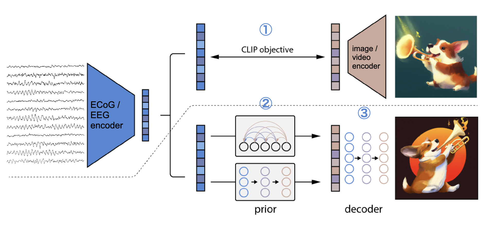

## 2023/09/28

### ① CLIP学習

- 様々な条件でsweepを回したが，test accuracyが上がらない．前処理でのバグの可能性も含め調査したが，今のところバグは無さそう．
訓練データの学習はできているので，とりあえず②，③の学習を（①と一貫したtrain/test splitで）行い，訓練データについてECoGから画像生成を行ってみる．

- [Report](https://api.wandb.ai/links/sensho/1q77p1bu)

### ② Prior学習

- 上手くいっている．

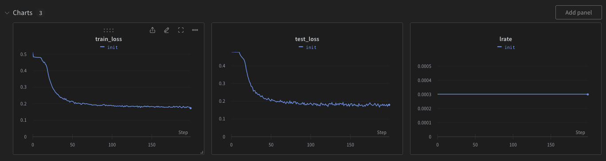

### ③ Decoder学習

- 上手くいっている．

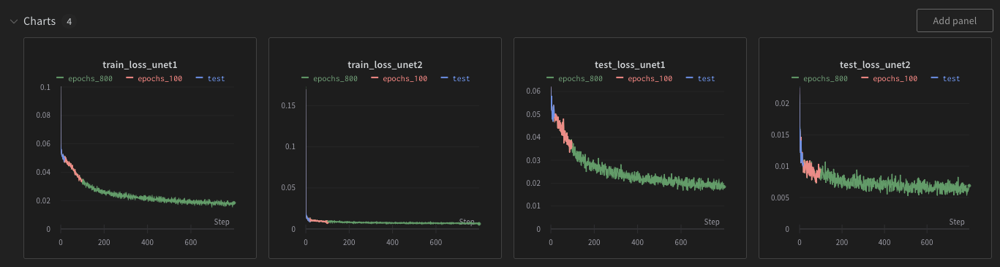

### 生成画像

- ①〜③で一貫したtrain/test splitをしていて，以下はtrainデータに対する生成画像．Testデータは①のCLIP学習が上手く行っていないのでまだ生成してみていない．

- 左がGT（RGBとBGRを間違えて保存してしまいました），右が生成画像．

  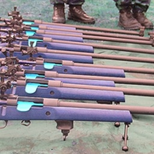
  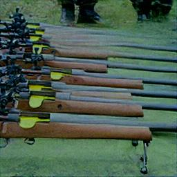

  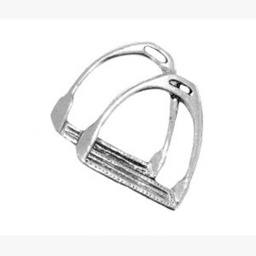
  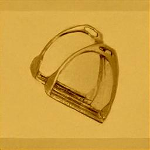

  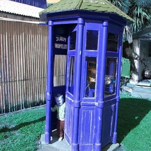
  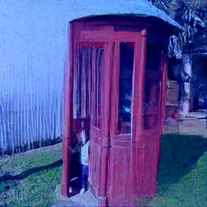

  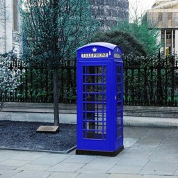
  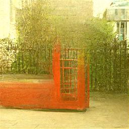

  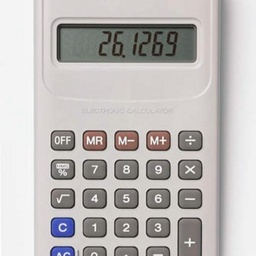
  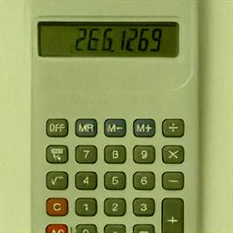

  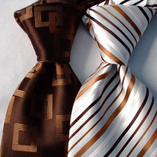
  

  
  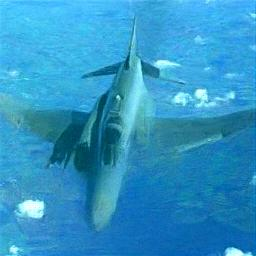

  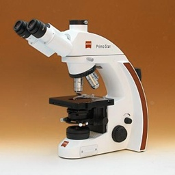
  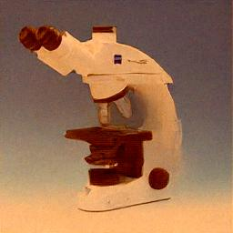

  
  

