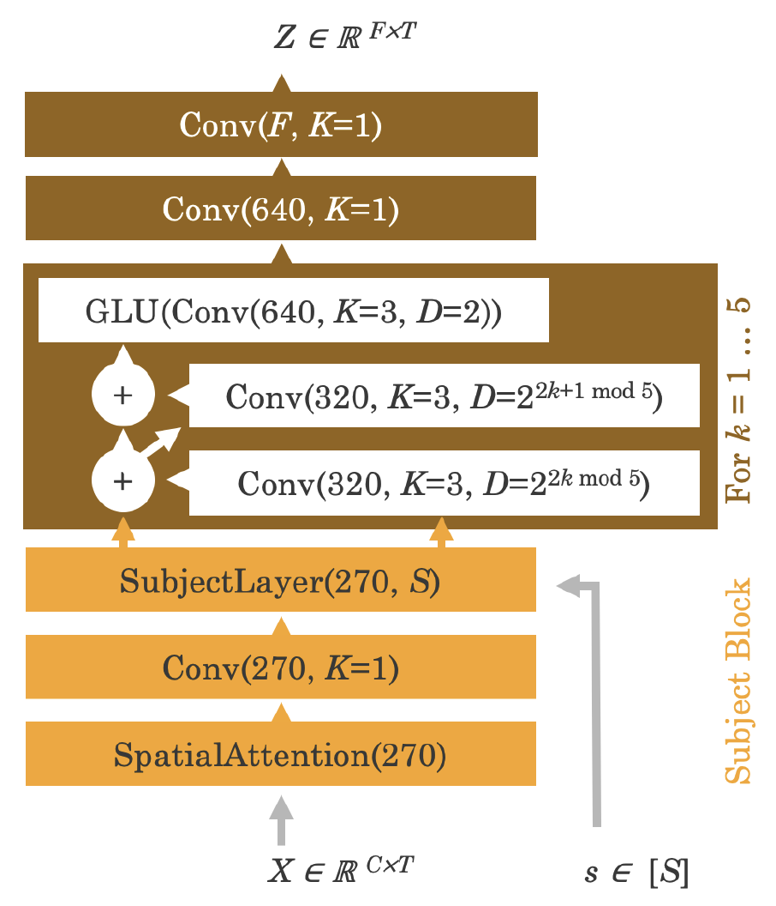

### Overview

### Original model architecture

### ECoG前処理

1. 0.1-250Hzでfilter，sklearnのRobustScalerでスケーリング，絶対値20を超えるものをclamp

1. ECoGデータの`trigger_info/stim_onset`情報を用い固定長（500msより長く取る場合もある）サンプルに分割．

1. 500Hzにresample

1. 各サンプルをその最初の20%時間の平均でベースライン補正

## 2023/09/28

### ① CLIP学習

様々な条件でsweepを回したが，test accuracyが上がらない．前処理でのバグの可能性も含め調査したが，今のところバグは無さそう．

- [Report](https://api.wandb.ai/links/sensho/1q77p1bu)

#### 試したこと

- Dynamic channel locations

  - オリジナルモデルのsubject layerは全被験者が同じ脳波計を同じように被っていることを前提としていた．これをチャンネル数・座標が異なってもモデルにincorporateできるようにするdynamic subject layerを作成してみた．

  - `/storage/data/freesurfer/Subject_ECoG/E*/elec_recon/E*.DURAL`を電極座標と思い使用したが，チャンネル数が実際のECoGデータと異なる場合が多く，実際に使用できたのはE0068, E0072, EJ0008, EJ001の4被験者のみ．

- いったんtrainとtestを混ぜてからsplitするmixed_deep, mixed_shallow

- ハイパラサーチ

  - seq_onset ={0.0, 0.5, 1.0, 1.5}s (duration=0.5s)

    - 画像掲示の何秒後からのデータを使い始めるか

    - 画像掲示が0.5sなので次以降の画像を見ている時間を取っていることに後から気づいた．

  - seq_len ={1.0, 1.5, 2.0}s (onset=0.0s)

    - onsetから何秒間のデータを使用するか

  - conv_blockのkernel_size={3, 5, 7}

  - d_drop ={0.1, 0.2, 0.3}

    - Spatial attentionのドロップアウト率

#### 訓練データの学習はできているので，とりあえず②，③の学習を（①と一貫したtrain/test splitで）行い，訓練データについてECoGから画像生成を行ってみる．

### ② Prior学習

上手くいっている．

### ③ Decoder学習

上手くいっている．

### 生成画像

- ①〜③で一貫したtrain/test splitをしていて，以下はtrainデータに対する生成画像．Testデータは①のCLIP学習が上手く行っていないのでまだ生成してみていない．

- 左がGT（RGBとBGRを間違えて保存してしまいました），右が生成画像．

  
  

  
  

  
  

  
  

  
  

  
  

  
  

  
  

  
  

